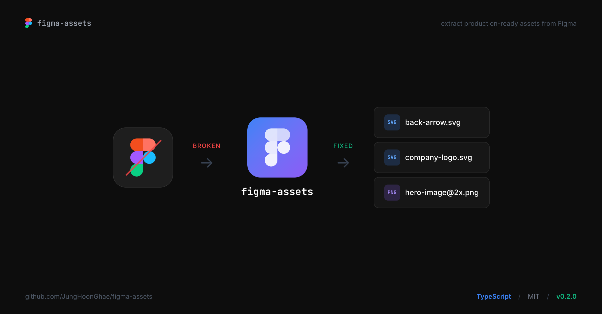
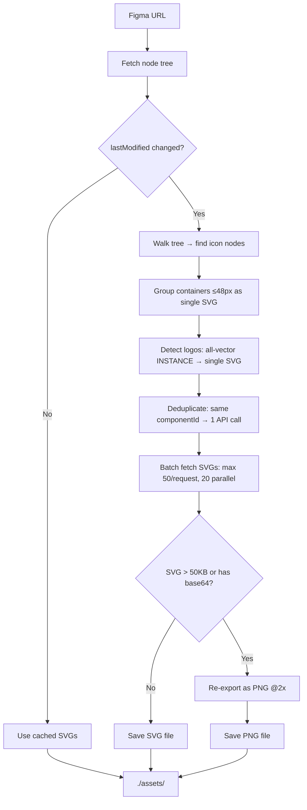

<div align="center">
  <h1>figma-assets</h1>
  <p>Extract production-ready SVG and raster assets from Figma.</p>
</div>

<p align="center">
  <a href="#quick-start"><strong>Quick Start</strong></a> ·
  <a href="#use-with-ai-agents"><strong>AI Agents</strong></a> ·
  <a href="#options"><strong>Options</strong></a> ·
  <a href="#why"><strong>Why</strong></a>
</p>

<p align="center">
  <a href="https://www.npmjs.com/package/figma-assets"></a>
  <a href="https://github.com/JungHoonGhae/figma-assets/stargazers"></a>
  <a href="LICENSE"></a>
  <a href="https://nodejs.org/"></a>
  <a href="https://github.com/JungHoonGhae/figma-assets/actions/workflows/ci.yml"></a>
</p>

<p align="center">
  <a href="README.ko.md">한국어</a>
</p>

<p align="center">
  
</p>

---

When AI agents (Cursor, Claude Code, etc.) implement Figma designs via the official MCP, icons come back as temporary URLs that expire in 7 days — or as SVG fragments like this:

```xml
<!-- What Figma's official MCP gives you -->
<svg preserveAspectRatio="none" width="100%" height="100%" viewBox="0 0 13.83 9.67">
  <path stroke="var(--stroke-0, #2D7FF9)" .../>
</svg>
```

No fixed size. Cropped canvas. CSS variable instead of an actual color. Breaks when you use it.

**figma-assets** gives you this instead:

```xml
<!-- What figma-assets gives you -->
<svg width="24" height="24" viewBox="0 0 24 24">
  <path stroke="#2D7FF9" .../>
</svg>
```

Complete icon. Fixed dimensions. Real color. Saved as an actual file in your project.

## Setup

**1.** Get a [Figma Personal Access Token](https://www.figma.com/settings) and set it:

```bash
export FIGMA_TOKEN=figd_xxxxxxxx
```

**2.** Node.js 18+.

## Quick Start

Add to your Claude Code or Cursor MCP settings:

```json
{
  "mcpServers": {
    "figma-assets": {
      "command": "npx",
      "args": ["figma-assets", "--serve"],
      "env": { "FIGMA_TOKEN": "figd_..." }
    }
  }
}
```

That's it. Your agent now has an `extract_assets` tool. When implementing a Figma design, give the agent a Figma URL (with `node-id`) and it extracts the assets automatically.

```
./assets/
├── back-arrow.svg            24×24, self-contained SVG
├── check.svg                 deduplicated (9 identical → 1 API call)
├── company-logo.svg          complex logo exported as single unit
├── hero-image@2x.png         raster auto-detected (1.1MB SVG → 13KB PNG)
└── ...
```

### Without MCP (CLI)

You can also run it directly:

```bash
npx figma-assets "https://figma.com/design/abc/File?node-id=123-456" -o ./assets
```

The Figma URL needs `node-id`. Get it by selecting a frame in Figma → right-click → **Copy link**.

## Options

| Flag | Default | |
|------|---------|---|
| `-o, --out-dir` | required | Output directory |
| `--scale` | `2` | Raster scale (1-4) |
| `--format` | `png` | Raster format: png / jpg |
| `--threshold` | `50000` | Raster detection threshold (bytes) |
| `--refresh` | `false` | Bypass cache |
| `--json` | `false` | JSON manifest output |
| `--serve` | | Start as MCP server |

## Config file

Optional `.figma-assets.json`:

```json
{
  "token": "$FIGMA_TOKEN",
  "outDir": "./src/assets",
  "rasterScale": 2
}
```

Cache goes to `.figma-assets/cache/`. When the Figma file is updated, the cache invalidates automatically — the `lastModified` timestamp comes from the same API call used to fetch the node tree, so there's no extra overhead. If nothing changed, SVG downloads are skipped entirely. `--refresh` forces a full re-download if needed.

---

## How it works



## API

```typescript
import { extract } from "figma-assets";

const result = await extract({
  figmaUrl: "https://figma.com/design/abc/File?node-id=123-456",
  token: process.env.FIGMA_TOKEN,
  outDir: "./assets",
});
```

## Star History

<a href="https://star-history.com/#JungHoonGhae/figma-assets&Date">
 <picture>
   <source media="(prefers-color-scheme: dark)" srcset="https://api.star-history.com/svg?repos=JungHoonGhae/figma-assets&type=Date&theme=dark" />
   <source media="(prefers-color-scheme: light)" srcset="https://api.star-history.com/svg?repos=JungHoonGhae/figma-assets&type=Date" />
   
 </picture>
</a>

## Contributing

Issues and PRs welcome. See [CHANGELOG.md](CHANGELOG.md) for release history.

## Support

If this is useful, help keep it maintained.

<a href="https://www.buymeacoffee.com/lucas.ghae">
  
</a>

## License

[MIT](LICENSE)

---

<p align="center">
  <sub>Made by <a href="https://github.com/JungHoonGhae">@JungHoonGhae</a></sub><br/>
  <sub><a href="https://x.com/lucas_ghae">@lucas_ghae</a> on X</sub>
</p>
